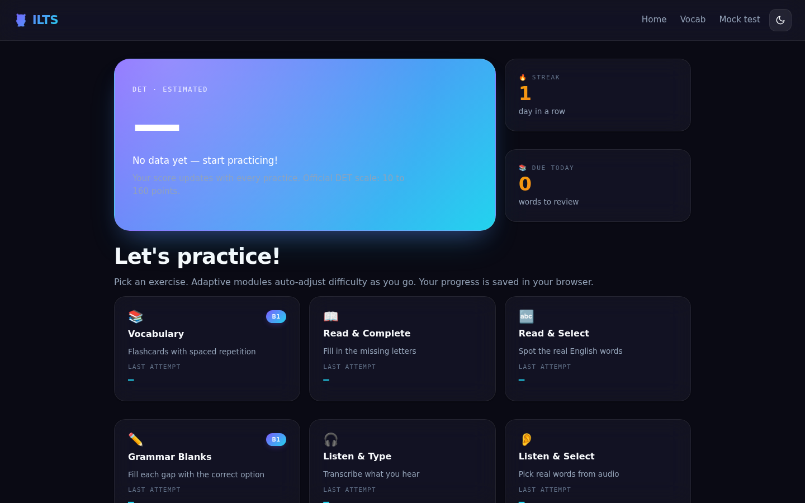
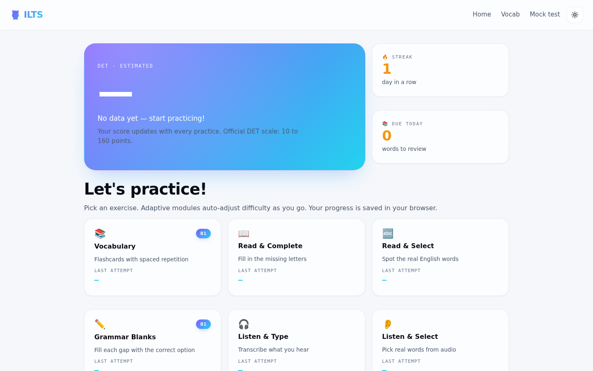
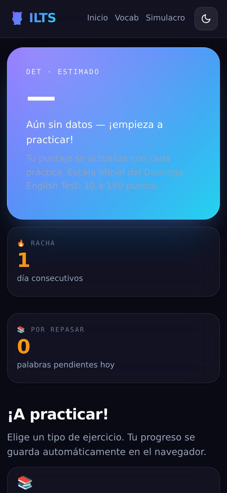
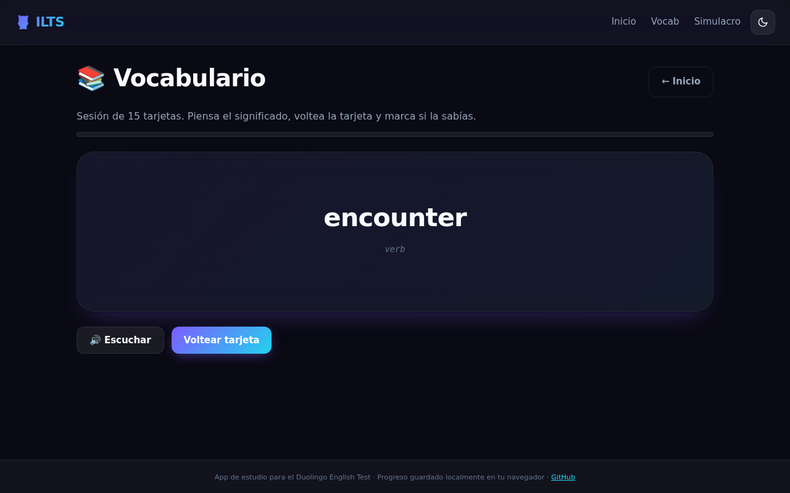
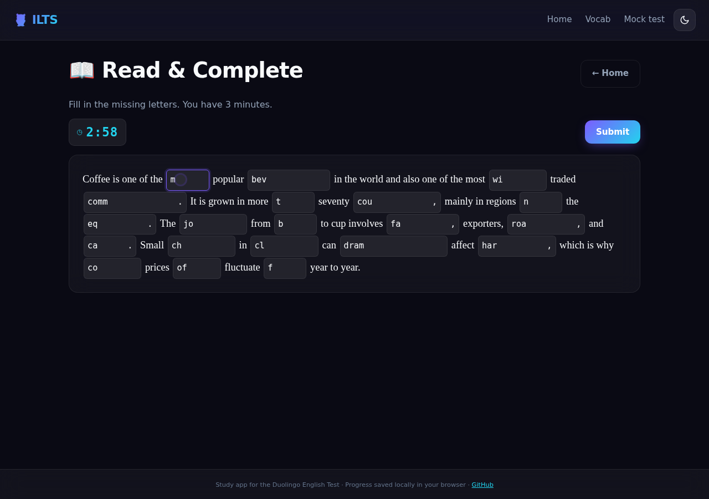
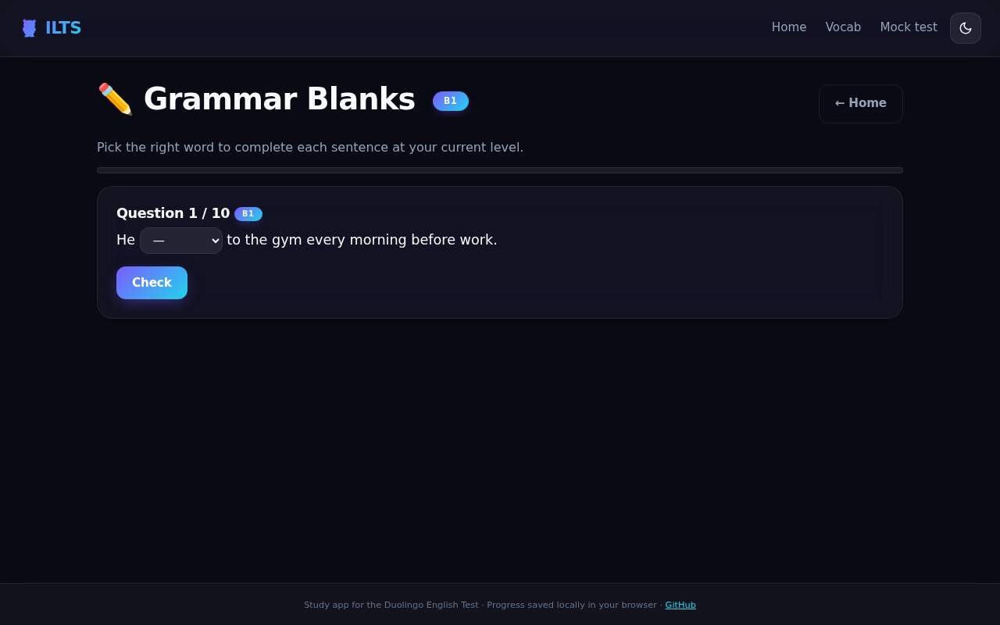

<div align="center">

# 🦉 ILTS — Interactive Language Training System

**A free, open-source prep app for the Duolingo English Test.**
Runs entirely in your browser. No sign-up, no tracking, no backend.

[](https://fabian-fuentes.github.io/ILTS/)
[](https://github.com/fabian-fuentes/ILTS/actions/workflows/pages.yml)
[](LICENSE)
[](#tech-stack)
[](#quickstart)
[](CONTRIBUTING.md)

🌐 **Try it live:** <https://fabian-fuentes.github.io/ILTS/>



</div>

---

## Screenshots

|                          Dark — Dashboard                          |                       Light — Dashboard                       |                       Mobile                       |
| :----------------------------------------------------------------: | :-----------------------------------------------------------: | :------------------------------------------------: |
|                        |       |              |

|                       Vocabulary                       |                      Read & Complete                       |                      Grammar Blanks                       |
| :----------------------------------------------------: | :--------------------------------------------------------: | :-------------------------------------------------------: |
|          |      |        |

## About

The **Duolingo English Test (DET)** is a 160-point online English proficiency exam accepted by 5000+ universities. It costs money, and most published prep material is locked behind paywalls.

**ILTS** is a browser-based study tool that lets you practice every DET question type, track your progress with spaced repetition, and get an estimated DET score based on your accuracy — all stored locally in your browser. The UI is in Spanish, targeted at Latin American students preparing for university admissions.

> ⚠️ **Disclaimer:** ILTS is an independent study aid. It is not affiliated with or endorsed by Duolingo. Estimated scores are approximations based on accuracy and should not be treated as official predictions.

## Features

- 📚 **Vocabulary flashcards** — 130+ academic words (B1–C1) with Leitner-box spaced repetition
- 📖 **Read & Complete** — 3-minute cloze passages where you fill in missing letters
- 🔤 **Read & Select** — 75-second real-vs-fake English word identification
- ✏️ **Grammar Blanks** — 10-question multiple-choice fill-in-the-blank drills
- 🎧 **Listen & Type** — Transcribe full sentences read by Web Speech API TTS
- 👂 **Listen & Select** — 90-second audio-based real-word identification
- 🖼️ **Write About Photo** — 60-second image description prompts (Unsplash)
- 📝 **Writing Sample** — 5-minute essay practice with real DET-style prompts
- 🏁 **Mock Test** — 6-question mixed simulation with DET score estimate and CEFR band (A1–C2)
- 🔥 **Streak tracking & progress persistence** — everything saved to `localStorage`
- 🌓 **Dark/light theme** with system-preference detection
- ♿ **Accessible** — keyboard navigation, focus rings, `prefers-reduced-motion` respected

## Tech stack

- **Vanilla JavaScript** (ES6 modules) — no framework
- **HTML5** + **CSS3** with custom properties, glassmorphism, and an animated aurora gradient background
- **Web Speech API** — `SpeechSynthesis` for listening exercises
- **localStorage** — single source of truth for progress (`det_progress_v1`) and theme (`ilts.theme`)
- **Google Fonts** — Space Grotesk (display), Inter (body), JetBrains Mono (numeric)
- **Zero dependencies.** **Zero build step.**

## Quickstart

Clone and serve any way you like — it's all static files.

```bash
git clone https://github.com/fabian-fuentes/ilts.git
cd ilts

# Option A: Python (ships on macOS/Linux)
python3 -m http.server 8000

# Option B: Node
npx serve .

# Option C: just open index.html in your browser
```

Then open <http://localhost:8000>.

## Project structure

```
ilts/
├── index.html              # SPA entry point
├── css/
│   └── styles.css          # Aurora Bento design system
├── js/
│   ├── app.js              # Hash router + bootstrap + theme
│   ├── storage.js          # localStorage wrapper
│   ├── scoring.js          # DET score estimation
│   ├── tts.js              # Web Speech API wrapper
│   └── modules/            # One module per exercise type
│       ├── dashboard.js
│       ├── vocabulary.js
│       ├── read-complete.js
│       ├── read-select.js
│       ├── fill-blanks.js
│       ├── listen-type.js
│       ├── listen-select.js
│       ├── write-photo.js
│       ├── writing-sample.js
│       └── mock-test.js
├── data/                   # Exercise content (JSON)
│   ├── vocabulary.json
│   ├── grammar.json
│   ├── reading.json
│   ├── listening.json
│   └── photos.json
└── docs/
    ├── ARCHITECTURE.md     # How the app is wired together
    ├── DATA-SCHEMA.md      # Shape of every JSON file
    └── DEPLOYMENT.md       # How to publish on Pages, Netlify, Vercel, CF
```

## Scoring

ILTS maps exercise accuracy (0–1) to the DET scale (10–160) using a simple linear mapping:

```
det = round(10 + accuracy × 150)
```

The dashboard score averages the last **5 attempts per section**, then averages those sections — so it tracks recent performance, not lifetime. Estimated scores map to CEFR bands:

| DET range | CEFR | Label                       |
|-----------|------|-----------------------------|
| 140–160   | C2   | Advanced high               |
| 120–139   | C1   | Advanced                    |
| 95–119    | B2   | Upper intermediate          |
| 75–94     | B1   | Intermediate                |
| 55–74     | A2   | Elementary                  |
| 10–54     | A1   | Beginner                    |

See [`js/scoring.js`](js/scoring.js) for the implementation.

## Roadmap

- [ ] Speaking module (record + self-assess)
- [ ] i18n — English and Portuguese UI
- [ ] PWA with offline support
- [ ] Export / import progress as JSON
- [ ] More vocabulary sets (Cxx, academic by field)
- [ ] Keyboard shortcuts overlay

## Contributing

PRs are welcome. Read [`CONTRIBUTING.md`](CONTRIBUTING.md) for the workflow, code style, and how to add new exercises or data entries.

## License

[MIT](LICENSE) © 2026 Fabian Fuentes
